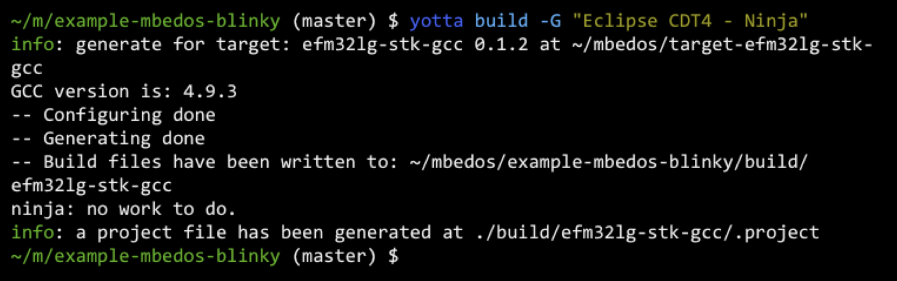
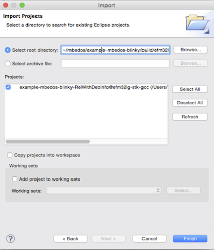
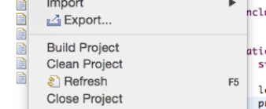
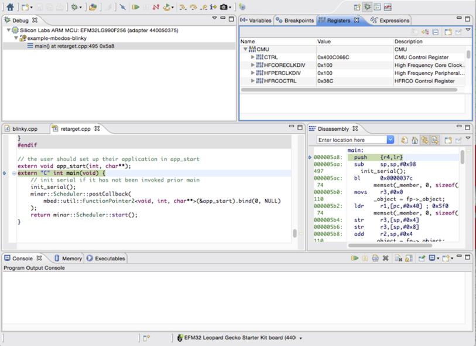

# Importing your mbed OS project to Simplicity Studio
 
After following the [Getting Started guide for mbed OS](https://docs.mbed.com/docs/getting-started-mbed-os/en/latest/) to get up and running on your EFM32 Starter Kit, you may want to utilize the more advanced features of Simplicity Studio, including the Simplicity IDE and Energy Profiler. 

In this guide, we use the EFM32 Leopard Gecko Starter Kit. But the instructions here are valid for all Silicon Labs mbed-enabled Starter Kits.

## Importing to Simplicity Studio 
 
To import a project to Simplicity Studio, we use the Eclipse CDT4 – Ninja CMake exporter. 

1. Run ``yotta build –G "Eclipse CDT4 – Ninja"`` in your project directory. This generates an Eclipse ``.project`` file.

    

1. Open Simplicity Studio. 

1. From the **File** menu, select **Import**.

    
 
1. Select **General > Existing Projects into Workspace**.

1. Click **Next**.
 
    

1. Browse to your project folder and select this as the root directory for the import (Simplicity Studio should automatically find your project and suggest it for importing). 

    

1. Click **Finish**.
 
You should now be able to see your project in Simplicity Studio. You’ll see that the source folder of your module has been symlinked into the Studio project, which has its root in the ``build/efm32lg-stk-gcc`` directory.
 

## Building and debugging

But the integration isn’t perfect. For one, you’ll find that the **Build** button is greyed out, and that the **Debug** button doesn’t work. To use these functions, you can go to **Project > Build Project**, or right-click the project and select **Build Project**. This builds the project using Ninja, the build tool used by yotta. If you prefer, you may also use ``yotta build`` in the command line.

### Debugging 

In order to debug the project, you need to add a debug configuration. 

1. Right-click the project and select **Debug as > Debug Configurations...**.
 
    

1. Add a new configuration for “Silicon Labs ARM Program”.

1. Browse to the executable; this is the file in the source folder with the same name as your project and no file extension. If no such file exists, it may have an ``.axf`` extension. 

1. Click **Debug** to start debugging.
 
    

Congratulations! You are now debugging your mbed OS application using Simplicity Studio. This means that you can take advantage of the Simplicity IDE features, including code correlation, breakpoints, watches and the register view.
 

### Accessing the Build button on the toolbar

In order to make the **Build** button on the toolbar work, you need to add a launch configuration (in addition to the debug configuration you added earlier). 

1. Right-click the project and select **Properties > Run/Debug Settings**.
 
1. Click **New…**.

1. Select “Silicon Labs ARM Part”. 

    

1. Uncheck the “Auto-select compatible device” checkbox.

1. Select your Starter Kit and part number from the dropdown boxes. 

1. Give your configuration a name.

1. Click **OK**. 

You can now easily restart debugging at any time using the **Debug** button on the toolbar.

## Energy Profiler

You can also take advantage of the Energy Profiler to create low-power mbed OS applications.

